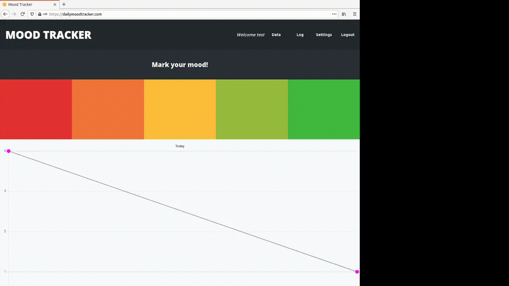

# [Mood Tracker](https://dailymoodtracker.com/)

**_A simple way to keep track of your moods throughout the day_**

Hosted at https://dailymoodtracker.com/



Technologies used:

- Docker
- Golang (backend uses [gin-gonic](https://github.com/gin-gonic/gin))
- MongoDB
- React.js & Redux (extra libs include react-chartjs-2, react-table, ...)

# Requirements

Needed in ./api/env.yml:

```yaml
server:
  port: <port number>

database:
  string: <mongodb connection string>

session:
  key: <session hash key>

origins: 
  - <origin 1>
  - <origin 2>
  - ...
```
